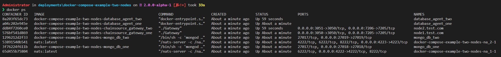

# Getting Started with Digital Bill of Materials - Setup Multiple Nodes

This tutorial will describe how to get started with the digital bill of
materials using docker. The sample docker-compose file will build and
run the required containers to get started.

- chainsource-gateway
- database-agent
- nats
- mongodb (with prisma)

Once these containers are running, the DBoM gateway
(chainsource-gateway) provides a REST interface with the APIs as
described in the [API Specs]{.title-ref}.

## Prerequisites and setup

- [Docker](https://www.docker.com/products/overview) - v24.0.2 or higher
- [Docker Compose](https://docs.docker.com/compose/overview/) - v2.19.1 or higher
- [Git client](https://git-scm.com/downloads) - needed for clone commands

## Running the sample program

### Terminal Window

#### Step 1

``` shell
  # Create a directory to clone the repositories
  mkdir dbom

  # Navigate to the directory
  cd dbom

  # Clone the deployments repository
  git clone https://github.com/DBOMproject/deployments.git

  # Clone the chainsource-gateway repository
  git clone https://github.com/DBOMproject/chainsource-gateway.git

  # Clone the database-agent repository
  git clone https://github.com/DBOMproject/database-agent.git

  # NOTE: Checkout to 2.0.0-alpha-1 branch on all the repositories
  git checkout 2.0.0-alpha-1

  # Generate certificates
  cd chainsource-gateway
  go run src/certs/generate_cert.go node1.test.com node2.test.com
  
  # Navigate to the docker-compose-quickstart-example-two-nodes folder
  cd deployments/docker-compose-quickstart-example-two-nodes
```

#### Step 2

Launch the network using docker-compose

``` shell
docker compose up
```

Once you run this command, the images will be built from the source code
and then the containers will be up and running. You can check the status
of the containers by running the following command

``` shell
docker ps
```

The output of the above command should be similar to the one below

<p align="center">
  
</p>

#### Step 3

With the containers started, next, test the APIs by executing the script *testAPIs.sh*. This will create few channels and assets on both the nodes.

``` shell
./testAPIs.sh
```

For more details refer [DBoM Documentation](https://dbom-project.readthedocs.io/en/2.0.0-alpha-1/what-dbom.html)
