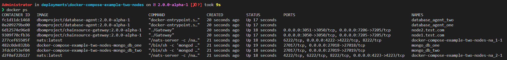

# Getting Started with Digital Bill of Materials - Setup Multiple Nodes

This tutorial will describe how to get started with the digital bill of
materials using docker. The sample docker-compose file will build and
run the required containers to get started.

- chainsource-gateway
- database-agent
- nats
- mongodb (local - with prisma)

Once these containers are running, the DBoM gateway
(chainsource-gateway) provides a REST interface with the APIs as
described in the [API Specs](https://github.com/DBOMproject/api-specs/tree/2.0.0-alpha-1).

## Prerequisites and setup

- [Docker](https://www.docker.com/products/overview) - v24.0.2 or higher
- [Docker Compose](https://docs.docker.com/compose/overview/) - v2.19.1 or higher
- [Git client](https://git-scm.com/downloads) - needed for clone commands

## Running the sample program

### Terminal Window

#### Step 1

``` shell
# Clone the deployments repository
git clone https://github.com/DBOMproject/deployments.git

# Checkout to 2.0.0-alpha-1
git checkout 2.0.0-alpha-1

# Navigate to the docker-compose-example-two-nodes folder
cd deployments/docker-compose-example-two-nodes
```

#### Step 2

Launch the network using docker-compose

``` shell
# Generate certificates
# node1.test.com and node2.test.com - should be same as your containers/nodes name
docker compose -f docker-compose-certs.yml  run --rm certificate_generator ./Generator node1.test.com node2.test.com

# Run all the services
docker compose up -d
```

Once you run this command, the images will be built from the source code
and then the containers will be up and running. You can check the status
of the containers by running the following command

``` shell
docker ps
```

The output of the above command should be similar to the one below

<p align="center">
  
</p>

#### Step 3

With the containers started, next, test the APIs by executing the script *testAPIs.sh*. This will create few channels and assets on both the nodes.

``` shell
./testAPIs.sh
```

For more details refer [DBoM Documentation](https://dbom-project.readthedocs.io/en/2.0.0-alpha-1/what-dbom.html)
