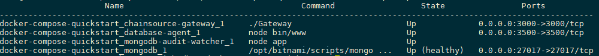

# Getting Started with Digital Bill of Materials

This tutorial will describe how to get started with the digital bill of materials using docker. The sample docker-compose file will build and run 4 containers viz.

- chainsource-gateway
- database-agent
- mongodb-audit-watcher
- mongodb

Once these containers are running, the Chainsource gateway provides a REST interface with the APIs as described in the [API Document](API.md).

### Prerequisites and setup:

* [Docker](https://www.docker.com/products/overview) - v18.0 or higher
* [Docker Compose](https://docs.docker.com/compose/overview/) - v1.25.0 or higher
* [Git client](https://git-scm.com/downloads) - needed for clone commands

## Running the sample program

### Terminal Window

#### Step 1

Clone this Git repository and navigate to the docker-compose-quickstart folder

#### Step 2

Launch the network using docker-compose

```
docker-compose -f docker-compose.yaml up -d --build
```

Once you run this command, the images will be built from the source code and then the containers will be up and running. You can check the status of the containers by running the following command

```
docker-compose ps
```

The output of the above command should be similar to the one below

<p align="center">
  
</p>


#### Step 3

With the containers started, next, test the APIs by executing the script - `testAPIs.sh`:

```
./testAPIs.sh
```

## 